ayudantia 5
================

``` r
library(tidyverse)
```

    ## ── Attaching packages ─────────────────────────────────────── tidyverse 1.3.0 ──

    ## ✓ ggplot2 3.3.3     ✓ purrr   0.3.4
    ## ✓ tibble  3.1.0     ✓ dplyr   1.0.5
    ## ✓ tidyr   1.1.3     ✓ stringr 1.4.0
    ## ✓ readr   1.4.0     ✓ forcats 0.5.1

    ## ── Conflicts ────────────────────────────────────────── tidyverse_conflicts() ──
    ## x dplyr::filter() masks stats::filter()
    ## x dplyr::lag()    masks stats::lag()

``` r
library(ggplot2)
library(dplyr)

sanguchez <- read.csv2("/Users/gabrielengel/Downloads/sanguchez.csv")
s <- sanguchez[c(4, 6)]
s$Precio = as.numeric(gsub("\\$", "", s$Precio))
```

    ## Warning: NAs introduced by coercion

``` r
s<- na.omit(s)

s$Precio<- as.numeric(s$Precio)
s$nota <- as.numeric(s$nota)

data_s<- s[, colnames(s) %in%  c("Precio", "nota")]
escal_s<- scale(data_s) %>% as_tibble()


escal_s %>% summary()
```

    ##      Precio              nota        
    ##  Min.   :-0.19665   Min.   :-1.9542  
    ##  1st Qu.:-0.09026   1st Qu.:-0.1398  
    ##  Median :-0.05564   Median :-0.1398  
    ##  Mean   : 0.00000   Mean   : 0.0000  
    ##  3rd Qu.:-0.01721   3rd Qu.: 0.7675  
    ##  Max.   :18.80927   Max.   : 1.6747

``` r
modelo_kmeans <- kmeans(escal_s, centers = 10)
modelo_kmeans2 <- kmeans(data_s, centers = 10)

escal_s$clus <- modelo_kmeans$cluster %>% as.factor()
data_s$clus <- modelo_kmeans2$cluster %>% as.factor()

ggplot(escal_s, aes(Precio, nota, color=clus)) + 
  geom_point(alpha=0.5, show.legend = T) +
  theme_bw()
```

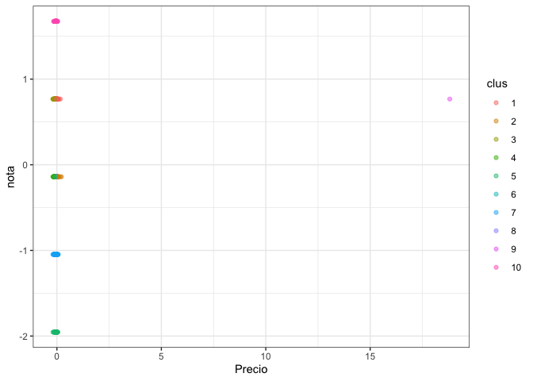<!-- -->

``` r
ggplot(data_s, aes(Precio, nota, color=clus)) +
  geom_point(alpha=0.5, show.legend = T) +
  theme_bw()
```

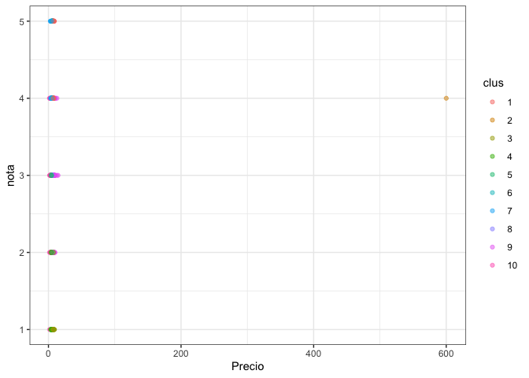<!-- -->

``` r
info_clus <- modelo_kmeans$centers
info_clus2 <- modelo_kmeans2$centers


SSinterior <- numeric(30)

for (k in 1:30) {
  modelo<- kmeans(escal_s, centers = k)
  SSinterior[k] <- modelo$tot.withinss
}
plot(SSinterior)
```

<!-- -->

``` r
#metodo del codo 2

k.max <- 30
wss1 <- sapply(1:k.max, function(k){kmeans(escal_s, k, nstart=50, iter.max = 8)$tot.withinss})

wss2<- sapply(1:k.max, function(k){kmeans(data_s, k, nstart=50, iter.max=8)$tot.withinss})

plot(1:k.max, wss1,
     type="b", pch = 19, frame = FALSE, 
     xlab="Numeros de clusters K",
     ylab="Total within-clusters sum of squares")
```

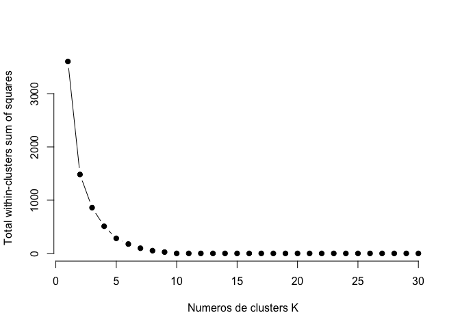<!-- -->

``` r
plot(1:k.max, wss2,
     type="b", pch = 19, frame = FALSE, 
     xlab="Numeros de clusters K",
     ylab="Total within-clusters sum of squares")
```

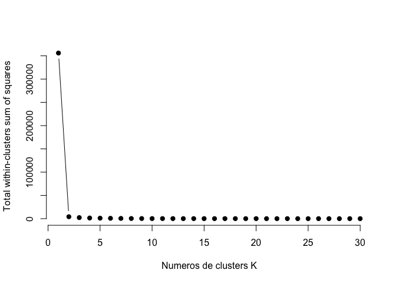<!-- -->

``` r
#evaluacion

escal_s$clus <- as.numeric(escal_s$clus)
data_s$clus <- as.numeric(data_s$clus)


tempDist <- dist(escal_s) %>% as.matrix()


index <- sort(modelo_kmeans$cluster, index.return=TRUE)
tempDist <- tempDist[index$ix,index$ix]
rownames(tempDist) <- c(1:nrow(escal_s))
colnames(tempDist) <- c(1:nrow(escal_s))

image(tempDist)
```

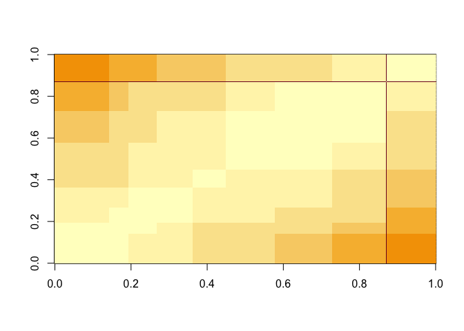<!-- -->

``` r
#hopkins
library(factoextra)
```

    ## Welcome! Want to learn more? See two factoextra-related books at https://goo.gl/ve3WBa

``` r
res <- get_clust_tendency(escal_s, n = 30, graph = FALSE)
res2 <- get_clust_tendency(data_s, n = 30, graph = FALSE)

print(res)
```

    ## $hopkins_stat
    ## [1] 0.9993976
    ## 
    ## $plot
    ## NULL

``` r
print(res2)
```

    ## $hopkins_stat
    ## [1] 0.9992066
    ## 
    ## $plot
    ## NULL

``` r
#indice correlacion

tempMatrix <- matrix(0, nrow = nrow(data_s), ncol = nrow(data_s))
tempMatrix[which(index$x==1), which(index$x==1)]  <- 1
tempMatrix[which(index$x==2), which(index$x==2)]  <- 1
tempMatrix[which(index$x==3), which(index$x==3)]  <- 1
tempMatrix[which(index$x==4), which(index$x==4)]  <- 1
tempMatrix[which(index$x==5), which(index$x==5)]  <- 1
tempMatrix[which(index$x==6), which(index$x==6)]  <- 1
tempMatrix[which(index$x==7), which(index$x==7)]  <- 1
tempMatrix[which(index$x==8), which(index$x==8)]  <- 1
tempMatrix[which(index$x==9), which(index$x==9)]  <- 1
tempMatrix[which(index$x==10), which(index$x==10)] <- 1


tempDist2 <- 1/(1+tempDist)


cor <- cor(tempMatrix[upper.tri(tempMatrix)],tempDist2[upper.tri(tempDist2)])

print(cor)
```

    ## [1] 0.9245193

``` r
library(flexclust)
```

    ## Loading required package: grid

    ## Loading required package: lattice

    ## Loading required package: modeltools

    ## Loading required package: stats4

``` r
withinCluster <- numeric(10)
for (i in 1:10){
  tempdata_s <- escal_s[which(modelo_kmeans$cluster == i),]
  withinCluster[i] <- sum(dist2(tempdata_s,colMeans(tempdata_s))^2)
}
cohesion = sum(withinCluster)

print(c(cohesion, modelo_kmeans$tot.withinss))
```

    ## [1] 0.5914991 0.5914991

``` r
#Separation
meandata_s <- colMeans(escal_s)
SSB <- numeric(10)
for (i in 1:10){
  tempdata_s <- escal_s[which(modelo_kmeans$cluster==i),]
  SSB[i] <- nrow(tempdata_s)*sum((meandata_s-colMeans(tempdata_s))^2)
}
separation = sum(SSB)

print(separation)
```

    ## [1] 3604.07

``` r
#coeficiente de silueta
library(cluster)
coefSil <- silhouette(modelo_kmeans$cluster,dist(escal_s))
summary(coefSil)
```

    ## Silhouette of 357 units in 10 clusters from silhouette.default(x = modelo_kmeans$cluster, dist = dist(escal_s)) :
    ##  Cluster sizes and average silhouette widths:
    ##        51        18        27        33        31        46        54        50 
    ## 0.9653664 0.9650113 0.9730973 0.9818613 0.9676774 0.9876729 0.9501958 0.9848760 
    ##         1        46 
    ## 0.0000000 0.9817108 
    ## Individual silhouette widths:
    ##    Min. 1st Qu.  Median    Mean 3rd Qu.    Max. 
    ##  0.0000  0.9663  0.9774  0.9704  0.9855  0.9909

``` r
fviz_silhouette(coefSil) + coord_flip()
```

    ##    cluster size ave.sil.width
    ## 1        1   51          0.97
    ## 2        2   18          0.97
    ## 3        3   27          0.97
    ## 4        4   33          0.98
    ## 5        5   31          0.97
    ## 6        6   46          0.99
    ## 7        7   54          0.95
    ## 8        8   50          0.98
    ## 9        9    1          0.00
    ## 10      10   46          0.98

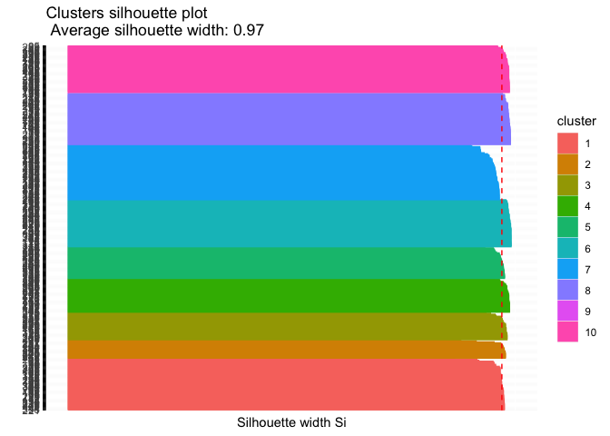<!-- -->

``` r
coefSil=numeric(30)
for (k in 2:30){
  modelo <- kmeans(escal_s, centers = k)
  temp <- silhouette(modelo$cluster,dist(escal_s))
  coefSil[k] <- mean(temp[,3])
}
tempDF=data.frame(CS=coefSil,K=c(1:30))

ggplot(tempDF, aes(x=K, y=CS)) + 
  geom_line() +
  scale_x_continuous(breaks=c(1:30))
```

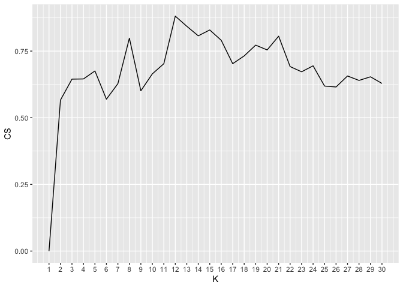<!-- -->

``` r
#2do analisis cluster
data_s2 <- data_s[, colnames(data_s) %in% c("Precio","nota")]
escal_s2 = scale(data_s) %>% as_tibble()

modelo_kmean <- kmeans(escal_s2, centers = 5)
modelo_kmean2 <- kmeans(data_s2, centers = 5)

escal_s2$clus2 <- modelo_kmean$cluster %>% as.factor()
data_s2$clus2 <- modelo_kmean2$cluster %>% as.factor()

ggplot(escal_s2, aes(Precio, nota, color=clus2)) +
  geom_point(alpha=0.5, show.legend = T) +
  theme_bw()
```

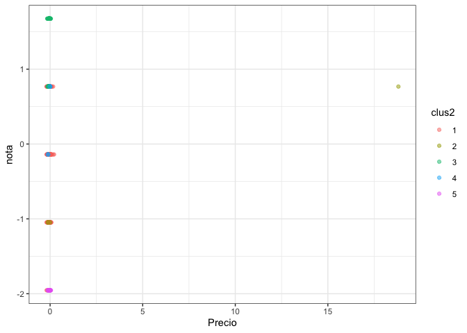<!-- -->

``` r
ggplot(data_s2, aes(Precio, nota, color=clus2)) +
  geom_point(alpha=0.5, show.legend = T) +
  theme_bw()
```

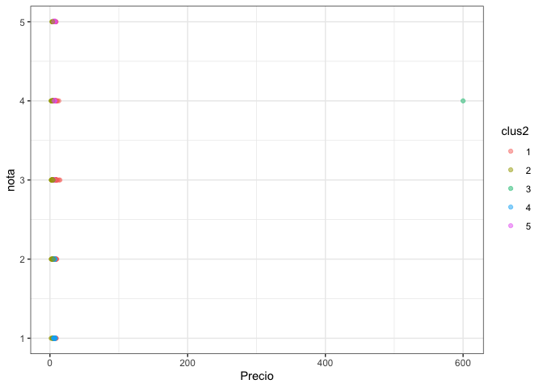<!-- -->

``` r
info_clusters <- modelo_kmean$centers
info_clusters2 <- modelo_kmean2$centers

info_clusters
```

    ##        Precio       nota       clus
    ## 1 -0.03208075 -0.2105467  0.9946391
    ## 2  0.48007032 -0.9936356 -0.8116412
    ## 3 -0.06412953  1.2584356 -0.3078317
    ## 4 -0.07198446  0.2258314 -0.8967650
    ## 5 -0.05083452 -1.9542346 -0.8799790

``` r
#evaluacion

escal_s2$clus <- as.numeric(escal_s2$clus2)
data_s2$clus <- as.numeric(data_s2$clus2)


tempDist_2 <- dist(escal_s2) %>% as.matrix()

index <- sort(modelo_kmean$cluster, index.return=TRUE)
tempDist_2 <- tempDist_2[index$ix,index$ix]
rownames(tempDist_2) <- c(1:nrow(data_s))
colnames(tempDist_2) <- c(1:nrow(data_s))

image(tempDist_2)
```

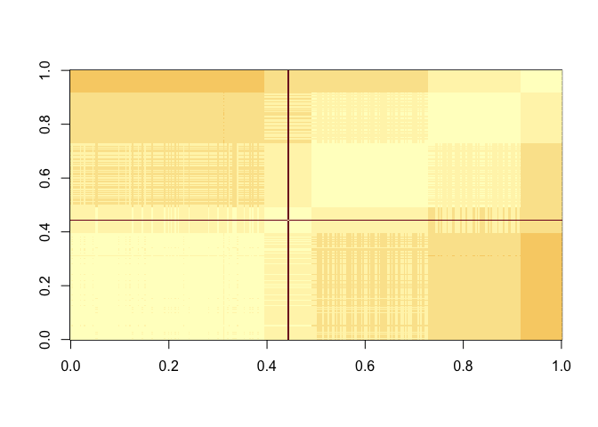<!-- -->

``` r
#hopkins

library(factoextra)

escal_s2$clus2 <- NULL
data_s2$clus2 <- NULL


res_1 <- get_clust_tendency(escal_s2, n = 30, graph = FALSE)
res_2 <- get_clust_tendency(data_s2, n = 30, graph = FALSE)

print(res_1)
```

    ## $hopkins_stat
    ## [1] 0.9993007
    ## 
    ## $plot
    ## NULL

``` r
print(res_2)
```

    ## $hopkins_stat
    ## [1] 0.9992055
    ## 
    ## $plot
    ## NULL

``` r
#indice de correlacion
tempMatrix2 <- matrix(0, nrow = nrow(escal_s2), ncol = nrow(escal_s2))
tempMatrix2[which(index$x==1), which(index$x==1)]  <- 1
tempMatrix2[which(index$x==2), which(index$x==2)]  <- 1
tempMatrix2[which(index$x==3), which(index$x==3)]  <- 1
tempMatrix2[which(index$x==4), which(index$x==4)]  <- 1
tempMatrix2[which(index$x==5), which(index$x==5)]  <- 1

tempDist_22 <- 1/(1+tempDist_2)


cor2 <- cor(tempMatrix2[upper.tri(tempMatrix2)],tempDist_2[upper.tri(tempDist_2)])

print(cor2)
```

    ## [1] -0.6382892

``` r
#indice de cohesion y separacion
library(flexclust) 
escal_s2 <- apply(escal_s2,2,as.numeric)

#Separation
meandata_s2 <- colMeans(escal_s2)
SSB <- numeric(4)
for (i in 1:4){
  tempdata_s2 <- escal_s2[which(modelo_kmean$cluster==i),]
  SSB[i] <- nrow(tempdata_s2)*sum((meandata_s2-colMeans(tempdata_s2))^2)
}
separation2 = sum(SSB)

print(separation2)
```

    ## [1] 679.5284

``` r
#coeficiente de silueta

library(cluster)

coefSil2 <- silhouette(modelo_kmean$cluster,dist(escal_s2))
summary(coefSil2)
```

    ## Silhouette of 357 units in 5 clusters from silhouette.default(x = modelo_kmean$cluster, dist = dist(escal_s2)) :
    ##  Cluster sizes and average silhouette widths:
    ##       141        34        85        67        30 
    ## 0.7575718 0.5238289 0.6700682 0.6784473 0.9742874 
    ## Individual silhouette widths:
    ##     Min.  1st Qu.   Median     Mean  3rd Qu.     Max. 
    ## -0.00384  0.54855  0.75274  0.71784  0.85897  0.98086

``` r
fviz_silhouette(coefSil2) + coord_flip()
```

    ##   cluster size ave.sil.width
    ## 1       1  141          0.76
    ## 2       2   34          0.52
    ## 3       3   85          0.67
    ## 4       4   67          0.68
    ## 5       5   30          0.97

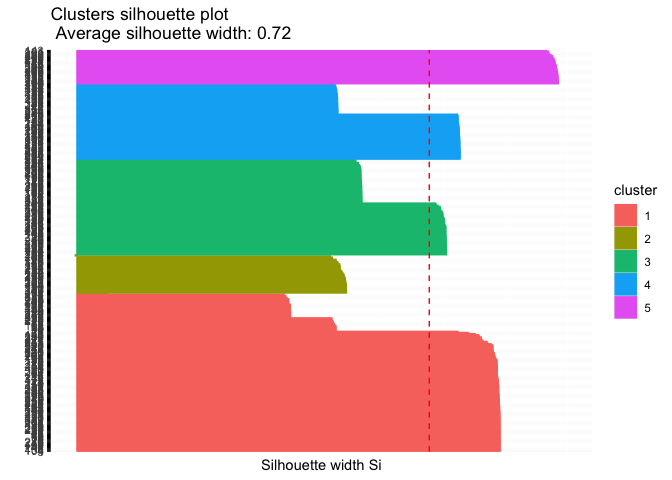<!-- -->
